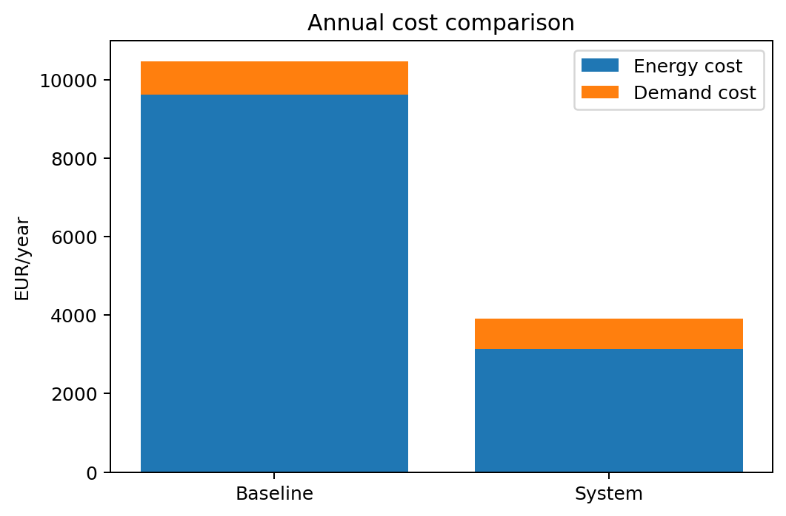
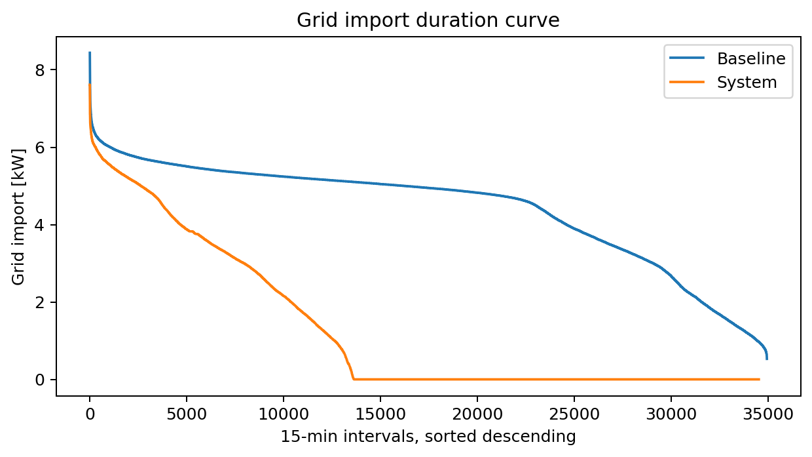
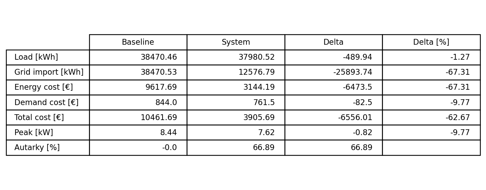

# Battery Energy Storage System Dispatch Optimizer

Ein modulares Python-System zur physikalischen Simulation und kostenoptimalen
Steuerung eines Batteriespeichers mit PV-Anlage. Das System kombiniert reale
DWD-Wetterdaten und Lastdaten mit einem physikalischen Batteriemodell und
einem täglichen LP-Optimizer (Pyomo/HiGHS) zu einer vollständigen
Jahressimulation mit rollierender Day-Ahead-Optimierung auf 15-Minuten-Intervallen.

Die mathematische Problemformulierung des Optimierungsmodells ist vollständig
formal dokumentiert: [`optimizer/problem_formulation.pdf`](optimizer/problem_formulation.pdf)

**Stack:** pvlib · Pyomo/HiGHS · Rainflow-Counting · Arrhenius-Degradation ·
Faiman-Thermalmodell · DWD/PVGIS-Datenpipeline

**Test Coverage:** optimizer 96% · battery_sim 88% · pv_sim 98% · Ruff/mypy clean

---

> **Proof of Concept:** Das System operiert aktuell mit Optimal Foresight als
> Baseline – ideale Kenntnis zukünftiger Last- und Erzeugungswerte – um die technische Funktionsfähigkeit und Plausibilität des Gesamtsystems zu prüfen. Der Lastprognose-
> Algorithmus ist in Entwicklung. Batterie- und PV-Parameter wurden frei gewählt;
> die gezeigten Ergebnisse sind Demo-Outputs, keine validierten realen Einsparungen.

## 1. Datenquellen

| Quelle | Inhalt | Zugang |
| --- | --- | --- |
| DWD (`00232`) | 10-min Wetter- und Solardaten (Augsburg) | automatisiert via `download/` |
| PVGIS | Lokales Horizontprofil | automatisiert via `download/` |
| Zenodo ([DOI:10.5281/zenodo.3899018](https://zenodo.org/records/3899018)) | Lastprofil in 15-Minuten-Abständen | manueller Download |

## 2. Downloader (`download/`)

Die Downloader lesen `configs/config.yaml`, laden die externen Daten für die
Station Augsburg Bayern (`00232`) und schreiben sie unter `data/pv/...`.

| Datei | Zweck | Output |
| --- | --- | --- |
| `download/run_downloads.py` | Orchestriert alle Downloads in der richtigen Reihenfolge. | keine eigene Datei |
| `download/meta_data.py` | Lädt DWD-Stationsmetadaten mit ID, Name, Breite, Länge und Höhe; Basis für Standort und PVGIS-Horizont. | `data/pv/general/metadata_stations.csv` |
| `download/weather.py` | Lädt DWD-10-Minuten-Wetterdaten: Lufttemperatur `TT_10`, Luftdruck `PP_10`, Wind `FF_10`; nötig für scheinbare Sonnenposition und Modultemperatur. | `data/pv/actual/dwd_meteo.csv` |
| `download/solar.py` | Lädt DWD-10-Minuten-Solardaten: Globalstrahlung `GS_10` und diffuse Strahlung `DS_10`; Input für DNI und Einstrahlung auf die Modulebene. | `data/pv/actual/dwd_solar_data.csv` |
| `download/horizon.py` | Lädt aus PVGIS das lokale Horizontprofil auf Basis der Stationskoordinaten; später zur Abschattung der Direktstrahlung. | `data/pv/general/pvgis_horizon_augsburg.csv` |

## 3. Datenhygiene

Zwischen Downloader und PV-Simulation werden die Eingangsdaten geprüft und
gezielt bereinigt, damit die späteren Simulationsschritte keine Energie aus
fehlenden Daten erzeugen.

1. Bei fehlender oder falscher Stations-ID, fehlendem oder falschem
   Stationsnamen oder `NaN`-Werten in der zugehörigen Metadatenzeile bricht der
   Download-Run direkt ab.
2. `NaN`-Werte in den Solardaten führen dazu, dass die PV-Produktion am
   zugehörigen Zeitstempel im finalen `pv_output.csv` auf `0` gesetzt wird.
   Dadurch wird vermieden, dass aus fehlenden Strahlungsdaten künstlich Energie
   erzeugt wird.
3. Das Horizontprofil wird in `download/validation.py` eingelesen und auf
   `NaN`-Werte in `horizon_height_deg` untersucht. Gefundene `NaN`-Werte werden
   auf `0` gesetzt.

`validation.py` erzeugt zusätzlich einen JSON-Report mit einer Übersicht der
durchgeführten Handlungen, damit nachvollziehbar bleibt, welche Daten im
Validierungsschritt verändert wurden.

## 4. PV-Simulation (`pv_sim/`)

`pv_sim/runner.py` führt die Pipeline chronologisch aus. Die wichtigsten
Parameter kommen aus `configs/config.yaml`: Zeitraum, 10-Minuten-Frequenz,
Modulausrichtung, Modulanzahl, Wechselrichterdaten und Verlustannahmen.

### Ablauf

1. `true_pos.py` berechnet die geometrische Sonnenposition für den Standort.
   Der Rechenzeitpunkt liegt in der Intervallmitte, der Output-Zeitstempel am
   Intervallende:

   ```text
   t_ref = t_start + Delta t / 2
   t_out = t_start + Delta t
   ```

   Output: `data/pv/actual/true_sp_10min.csv` mit Zenit, Elevation und Azimut.

2. `seen_pos.py` korrigiert die Sonnenposition mit Temperatur und Luftdruck zur
   scheinbaren Sonnenposition. Dazu werden die Meteowerte auf Intervallmitten
   gemittelt:

   ```text
   T_mid = (T_i + T_(i-1)) / 2
   p_Pa = PP_10_mid * 100
   ```

   Output: `data/pv/actual/apparent_sp.csv` mit apparent zenith/elevation/azimuth
   und Refraktionskorrektur.

3. `compute_dni.py` verbindet DWD-Solardaten mit der Sonnenposition. Falls die
   DWD-Werte als `jcm2` konfiguriert sind, werden sie in `W/m2` umgerechnet:

   ```text
   factor = 10000 / Delta t_s
   GHI = GS_10 * factor
   DHI = DS_10 * factor
   DNI approx (GHI - DHI) / cos(theta_z)
   ```

   Output: `data/pv/actual/dni.csv` mit `ghi_wm2`, `dhi_wm2`, `dni_wm2`.

4. `compute_poa.py` interpoliert zuerst die Horizonthöhe auf den aktuellen
   Sonnenazimut. Liegt die Sonne unter dem Horizontprofil, wird die
   Direktstrahlung auf 0 gesetzt:

   ```text
   shaded = apparent_elevation <= horizon_height(azimuth)
   DNI_shaded = 0, wenn shaded, sonst DNI
   ```

   Danach berechnet pvlib mit `perez-driesse` die Einstrahlung auf die geneigte
   Modulebene:

   ```text
   POA_global = POA_direct + POA_diffuse
   ```

   Output: `data/pv/actual/poa.csv` mit globaler, direkter, diffuser, Sky- und
   Boden-Komponente.

   

5. `compute_effective_irradiance.py` berechnet den Einfallswinkel auf das Modul
   und reduziert den Direktanteil über den IAM-Faktor:

   ```text
   cos(AOI) = cos(theta_z) * cos(beta)
            + sin(theta_z) * sin(beta) * cos(gamma_s - gamma_p)

   effective_irradiance = POA_direct * IAM(AOI) + POA_diffuse
   ```

   Output: `data/pv/actual/effective_irradiance.csv`.

6. `modul_sim.py` berechnet aus Einstrahlung, Temperatur, Verlusten und
   Wechselrichtermodell die elektrische Energie. Zentrale Gleichungen:

   ```text
   T_module = T_air + POA_global / (u0 + u1 * wind_speed)

   P_dc_gross = P_dc0_total * effective_irradiance / 1000
                * (1 + gamma_pdc * (T_module - 25))

   age_loss_pct = annual_age_loss_pct * years_since_start
   P_dc_net = P_dc_gross * (1 - loss_pct / 100)
   E_net_ac_kwh = P_ac_w / 1000 * Delta t_h
   ```

   Output: `data/pv/actual/debug/energy_curve.csv` als detaillierte
   Energiekurve und `data/pv/actual/pv_output.csv` als kompakter Input für
   Optimizer und Batterie.

7. `visualization/energy_prod_visual.py` aggregiert die Energiekurve auf
   Tageswerte und plottet zusätzlich einen 14-Tage-Mittelwert.
   `visualization/horizon_visual.py` visualisiert das PVGIS-Horizontprofil.

### Finaler Output

Die detaillierte Ergebnisdatei ist `data/pv/actual/debug/energy_curve.csv`. Sie
enthält pro 10-Minuten-Zeitpunkt unter anderem:

- `poa_global`: Einstrahlung auf Modulebene
- `effective_irradiance`: für das Modul wirksame Einstrahlung
- `t_module_faiman_c`: berechnete Modultemperatur
- `p_dc_gross_w` / `p_dc_net_w`: DC-Leistung vor und nach Verlusten
- `p_ac_w`: AC-Leistung nach Wechselrichter
- `e_net_ac_kwh`: erzeugte AC-Energie im Intervall

Für die weiteren EMS-Schritte wird daraus zusätzlich
`data/pv/actual/pv_output.csv` geschrieben. Diese Datei enthält `pv_kw` und die
Umgebungstemperatur `ambient_temp_degC` auf dem PV-Zeitstempelraster.


## 5. Batterie-Simulation (`battery_sim/`)

Die Batterie-Simulation beschreibt, wie ein geplanter Speicherfahrplan
physikalisch umgesetzt wird. Der Fahrplan besteht aus einer Leistung
`action_kw`: positive Werte stehen für Laden, negative Werte für Entladen. Die
Simulation prüft dann je Zeitschritt, welche Leistung wegen SoC-Grenzen,
Leistungsgrenzen und Temperatur tatsächlich möglich ist. Dadurch bleibt die
Optimierung einfach, aber die Batterieausführung enthält die wichtigeren
realistischen Effekte.

### Ablauf

1. `simulator.py` bereitet den Aktionsplan vor. Erwartet werden
   `timestamp_utc`, `action_kw` und `ambient_temp_degC`. Die Zeitstempel werden
   nach UTC sortiert, Leistung und Temperatur werden als numerische Werte
   validiert.

2. `battery_core.py` führt den eigentlichen Speicherzeitschritt aus. Der SoC
   bleibt immer zwischen `soc_min` und `soc_max`, und die angefragte Lade- oder
   Entladeleistung wird zuerst durch die Nennleistung begrenzt:

   ```text
   P_charge <= charge.max_kw
   P_discharge <= discharge.max_kw
   E_min <= SoC <= E_max
   ```

   Zusätzlich gibt es eine temperaturabhängige Leistungsbegrenzung. Zwischen
   harter Minimaltemperatur und optimalem Temperaturfenster steigt die erlaubte
   Leistung linear an, im optimalen Fenster ist sie vollständig verfügbar und
   oberhalb des optimalen Fensters fällt sie wieder linear bis zur harten
   Maximaltemperatur ab. Außerhalb der harten Grenzen ist Laden oder Entladen
   nicht erlaubt.

3. Die Wirkungsgrade sind ebenfalls temperaturabhängig. Im optimalen
   Temperaturfenster wird `eta_nominal` verwendet. Bei kalten oder heißen
   Bedingungen erhöhen `loss_factor_cold` und `loss_factor_hot` die Verluste.
   Für den SoC gilt damit vereinfacht:

   ```text
   SoC_next = SoC
            + E_charge_ac * eta_charge(T_bat)
            - E_discharge_ac / eta_discharge(T_bat)

   loss_kwh = Energieverlust aus Lade- oder Entladevorgang
   ```

   Das Ergebnis ist `actual_kw`. Dieser Wert kann kleiner sein als die geplante
   Aktion, wenn Leistung, Temperatur oder SoC limitieren.

4. `temp.py` modelliert die Batterietemperatur als ein konzentriertes
   thermisches System erster Ordnung. Die Umgebungstemperatur kommt aus der
   Wetter-/PV-Zeitreihe, die Wärmequelle sind die elektrischen Verluste aus dem
   Batteriemodell:

   ```text
   Q_bat = loss_kwh * heat_to_battery_fraction
   R_th = thermal_time_constant_h / heat_capacity_kwh_per_degC
   T_eq = T_ambient + R_th * Q_bat / Delta t
   T_next = T_eq + (T_bat - T_eq) * exp(-Delta t / thermal_time_constant_h)
   ```

   Damit reagiert die Batterie nicht sprunghaft auf Außentemperatur und
   Verlustwärme, sondern nähert sich mit einer thermischen Trägheit an das
   jeweilige Gleichgewicht an.

5. `degradation.py` aktualisiert die Alterung periodisch. Die Simulation sammelt
   SoC, Temperatur und Leistung innerhalb eines Monats und schließt den
   Degradationsschritt am Monatswechsel. Anschließend wird die verfügbare
   Kapazität reduziert und der SoC wieder auf die neuen Grenzen geklemmt.

### Degradation

Die Degradation besteht aus Kalender- und Zyklenalterung. Für Zyklen wird aus
der SoC-Zeitreihe mit Rainflow-Zählung die Zyklenbelastung bestimmt. Tiefe
Zyklen werden über den DoD-Exponenten stärker gewichtet, hohe Temperaturen
erhöhen den Stress über einen Arrhenius-Faktor und hohe C-Raten können die
Zyklenalterung zusätzlich verstärken.

Die Kalenderalterung hängt von verstrichener Zeit, Batterietemperatur und SoC
ab. Sehr niedrige und sehr hohe SoC-Bereiche werden über eigene Stressfaktoren
bestraft, der mittlere Bereich bleibt der Referenzfall. Der Kapazitätsfaktor
wird danach aus beiden Alterungsanteilen gebildet:

```text
capacity_factor = (1 - cycle_fade) * (1 - calendar_fade)
capacity_kwh = nominal_capacity_kwh * capacity_factor
```

### Finaler Output

Die Batterie schreibt drei Ergebnisdateien:

- `data/battery/battery_sim.csv`: geplante und tatsächlich gefahrene Aktion,
  Lade-/Entladeenergie, Verluste, SoC und verfügbare Kapazität.
- `data/battery/battery_temperature.csv`: Batterietemperatur je Zeitschritt.
- `data/battery/battery_degradation.csv`: monatliche Alterungskennzahlen,
  kumulierte EFC, Kalenderalterung, Zyklenalterung und Kapazitätsfaktor.

## 6. Optimizer (`optimizer/`)

Der Optimizer plant den Batteriebetrieb auf Basis von PV-Prognose, Lastprofil,
Tarifparametern und aktuellem Batteriezustand. In `proof_of_concept.py` wird er
rollierend pro Tag aufgerufen: End-SoC, tatsächlicher Jahrespeak und reduzierte
Batteriekapazität werden in den nächsten Optimierungslauf übernommen.

`optimizer.py` formuliert das Problem in Pyomo und löst es mit HiGHS. Die
wichtigsten Entscheidungsvariablen sind Netzbezug, Ladeleistung,
Entladeleistung, PV-Abregelung, Batterieenergie und der neue Jahrespeak.
Zentrale Nebenbedingungen sind die Leistungsbilanz, die Batteriedynamik, SoC-
und Leistungsgrenzen, PV-Abregelung und Peak-Fortschreibung:

```text
PV_t + Grid_t + Discharge_t = Load_t + Charge_t + Curtailment_t

E_bat[t+1] = E_bat[t]
           + eta_charge * Charge_t * Delta t
           - Discharge_t * Delta t / eta_discharge

P_peak_new >= Grid_t
P_peak_new >= P_peak_before
```

Die Zielfunktion minimiert Energiebezugskosten, zusätzliche Leistungskosten und
einen Durchsatzkosten-Term für Batteriealterung. Der End-SoC erhält einen
Restwert, damit der Optimizer die Batterie am Horizontende nicht künstlich leer
fährt:

```text
min  energy_price * Delta t * sum_t Grid_t
   + demand_charge * (P_peak_new - P_peak_before)
   + throughput_cost * Delta t
       * sum_t (eta_charge * Charge_t + Discharge_t / eta_discharge)
   - terminal_value * E_bat[T]

throughput_cost = battery_replacement_cost
                  / (2 * usable_capacity_kwh * expected_efc)

terminal_value = eta_discharge * energy_price
```

Das Modell ist importseitig formuliert: Netzbezug ist nicht negativ, PV-Überschuss
kann bei Bedarf abgeregelt werden. Die Optimierung verwendet nominale
Wirkungsgrade und die aktuell verfügbare Kapazität; Temperaturdetails und
Degradation werden anschließend in der Batterie-Simulation realisiert.

Die vollständige mathematische Formulierung liegt als PDF unter
[`optimizer/problem_formulation.pdf`](optimizer/problem_formulation.pdf).
Der geplante Dispatch wird nach `data/optimizer/optimizer_dispatch.csv`
geschrieben.

## 7. Results (`data/results/`)

Nach Optimizer und Batterie-Simulation werden zwei Dispatch-Dateien erzeugt.
`data/results/baseline_dispatch.csv` beschreibt den Netzbezug des Lastprofils
ohne EMS. `data/results/system_dispatch.csv` kombiniert Last, PV-Erzeugung und
tatsächlich simulierte Batterieaktion und berechnet daraus Netzbezug,
Energiekosten und Leistungspreisanteile.

Die folgenden Plots werden aus diesen beiden Dateien erzeugt.



Der Kostenplot vergleicht Baseline und System als gestapelte Balken aus
Energie- und Leistungskosten. In der gewählten Demo-Konfiguration senkt das EMS die simulierten Gesamtkosten
deutlich. Die Ergebnisse dienen als technischer Plausibilitäts- und
Integrationsnachweis, nicht als validierte Wirtschaftlichkeitsrechnung.



Die Dauerlinie sortiert alle Netzbezugsintervalle absteigend. Sie zeigt, wie
häufig das System im Vergleich zur Baseline hohe Netzbezugsleistungen benötigt
und ob Lastspitzen in der Demo-Konfiguration reduziert werden.



Die KPI-Tabelle fasst Baseline, System und Differenz in einer Ansicht zusammen.
Sie macht sichtbar, wie sich Netzbezug, Kosten, Peak und Autarkie gemeinsam
verändern und dient als kompakter Überblick über den Gesamteffekt des EMS.

## 8. Sanity Check (`sanity/random_benchmark.py`)

`sanity/random_benchmark.py` läuft standardmäßig mit `--runs 100 --seed 42`. Im
aktuellen Output wurden `100` zulässige Random-Fahrpläne gegen denselben
Jahresdatensatz simuliert. Random heißt: PV, Last, Wetter und Tarife bleiben
identisch; nur `action_kw` wird je Zeitschritt zufällig innerhalb der
planerisch zulässigen Grenzen gezogen.

```text
grid_import_kw = max(Load_t - PV_t + actual_kw_t, 0)
grid_import_kwh = grid_import_kw * Delta t

grid_cost = sum(grid_import_kwh * energy_price)
          + demand_charge * max(grid_import_kw)

wear_proxy = sum(eta_charge * E_charge_ac
                 + E_discharge_ac / eta_discharge)
             * replacement_cost / (2 * usable_capacity * expected_efc)
```
Aktueller Befund aus `data/results/random_benchmark_summary.csv`: Der Optimizer
liegt bei den Netzkosten unter allen `100` Random-Runs (`0/100` Random-Runs
besser). Beispielwerte aus dem aktuellen Demo-Output: Optimizer `3592 EUR`
Grid-Kosten vs. Random-Median `4589 EUR`. Gleichzeitig ist der Optimizer
aggressiver: `228` kumulative EFC und `1.286 kWh` Kapazitätsverlust vs.
Random-Median `144` EFC und `0.958 kWh`. Die Zahlen sind wie bereits erwähnt Demo-Kennzahlen.


## 9. Setup und Qualitätssicherung

### Reproduzierbares Setup

Das Projekt nutzt `pyproject.toml` für Dependency-Bereiche und `uv.lock` für
exakt reproduzierbare Paketversionen. Ein lokales Setup wird mit uv erzeugt:

```powershell
uv sync --locked
```

Prüfen, ob `uv.lock` noch zur `pyproject.toml` passt:

```powershell
uv lock --check
```

Nach bewussten Dependency-Änderungen den Lockfile aktualisieren:

```powershell
uv lock
```

Typische Checks laufen dann über die gelockte Umgebung:

```powershell
uv run ruff check .
uv run mypy .
uv run pytest
```

Demo starten:

```powershell
uv run python proof_of_concept.py
```

### Test Scope

Die Tests fokussieren aktuell die dauerhaft angelegten Kernkomponenten des
Projekts: den Optimizer, die vollständige Batterie-Simulation (`battery_sim/`)
und die vollständige PV-Simulation (`pv_sim/`). Diese Bereiche bilden die
technische Basis, die auch in späteren Iterationen voraussichtlich bestehen
bleibt.

Aktueller Coverage-Stand der getesteten Kernbereiche:

- `optimizer/`: 96% (`optimizer.py`: 96%)
- `battery_sim/`: 88% (`battery_core.py`: 89%, `degradation.py`: 77%,
  `simulator.py`: 97%, `temp.py`: 96%)
- `pv_sim/`: 98% (`compute_dni.py`: 97%, `compute_poa.py`: 100%,
  `compute_effective_irradiance.py`: 100%, `modul_sim.py`: 100%,
  `runner.py`: 98%, `seen_pos.py`: 100%, `true_pos.py`: 93%,
  Visualisierung: 97-98%)

Die Coverage-Zahlen zeigen nur, welche Codebereiche durch Tests ausgeführt
werden; sie sind kein direkter Nachweis für fachlich sinnvolle oder vollständige
Tests.

Andere Dateien wie `proof_of_concept.py` oder `optimizer/forecast_df.py` sind
aktuell noch Übergangs- bzw. Hilfsdateien und werden später voraussichtlich
ersetzt. Für diese Dateien gibt es deshalb bewusst noch keine eigene Testsuite.

### Ruff und Mypy

Ruff und Mypy sind aktuell vollständig sauber:

```powershell
uv run ruff check .
uv run ruff format --check .
uv run mypy .
```
