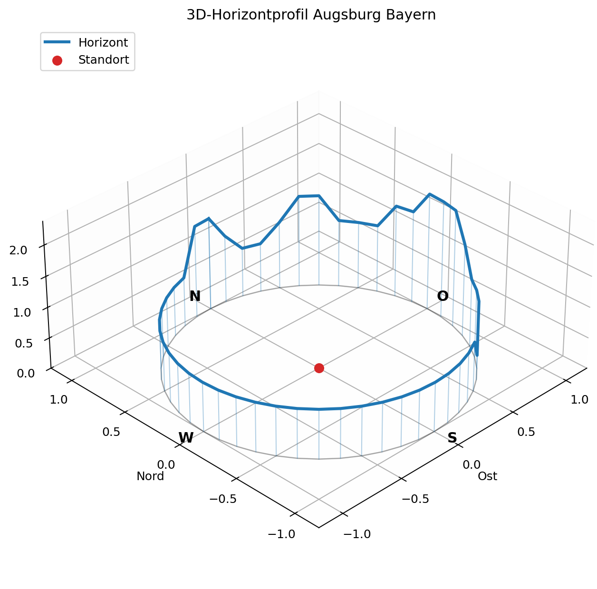
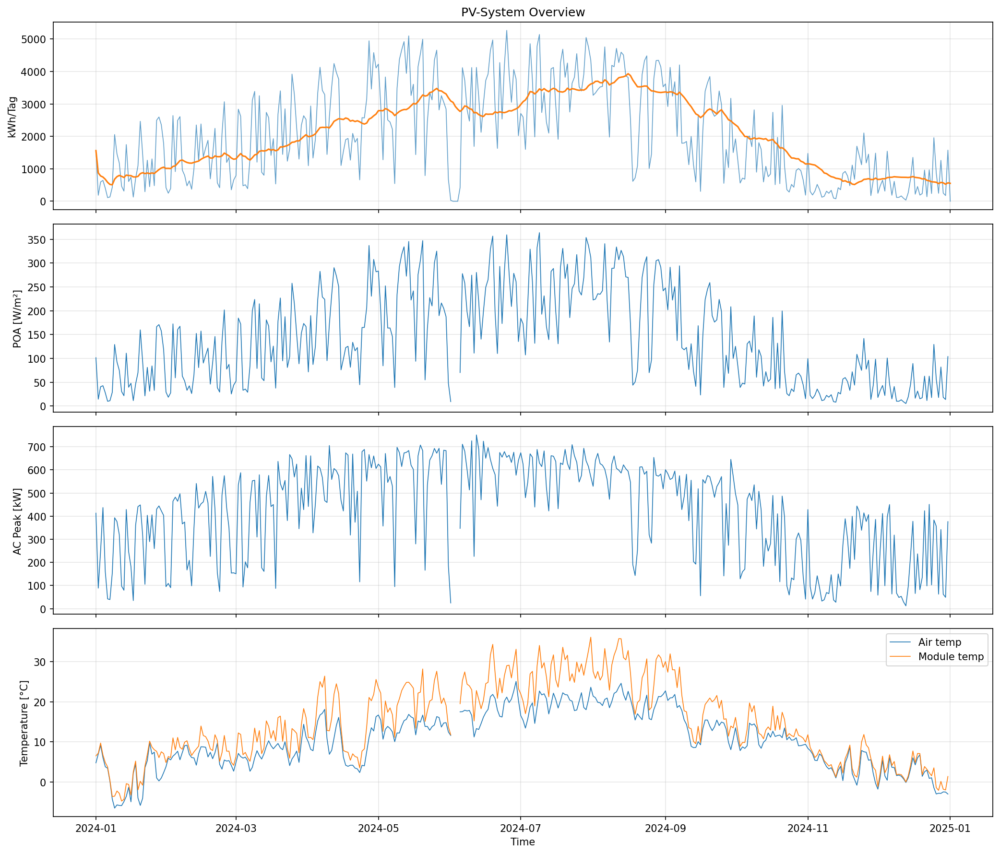
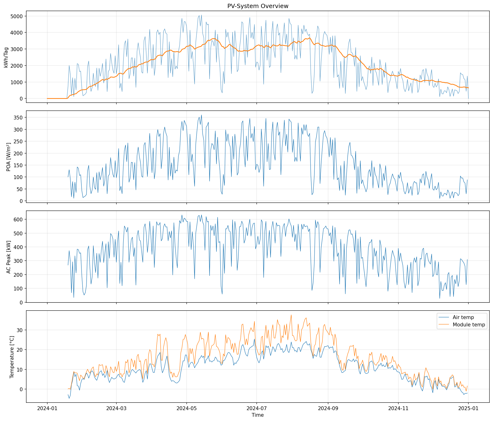
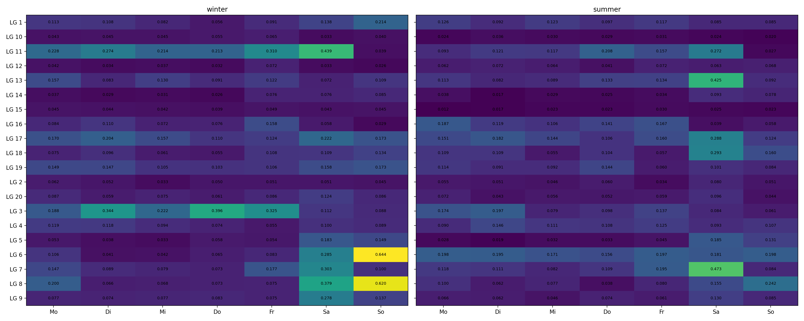

# PV-Simulation

Kurzfassung der PV-Erzeugungssimulation. Aus DWD-/Forecast-Wetterdaten,
DWD-/Forecast-Strahlung, Stationsdaten und PVGIS-Horizontprofil wird eine
AC-Energiezeitreihe berechnet.

## Wichtig

- Standort: Augsburg Bayern
- Zeitraster Actual: `10min`
- Zeitraster Forecast: `15min` laut aktueller Config
- Ausrichtung: Sued, `180 deg`
- Neigung: `20 deg`
- Config: `configs/config.yaml`
- Hauptausgabe Actual: `data/pv/actual/energy_curve.csv`
- Hauptausgabe Forecast: `data/pv/forecast/energy_curve.csv`

## Ausfuehren

Die Gesamtpipeline startet Actual- und Forecast-PV:

```bash
python runner.py
```

Der PV-Runner selbst liegt in `pv_sim/run_pv.py` und wird aus Python ueber
`run_pv(paths, config)` aufgerufen.

## Aktuelle Ordnerstruktur

```text
pv_sim/
  run_pv.py
  true_pos.py
  seen_pos.py
  compute_dni.py
  compute_poa.py
  compute_effective_irradiance.py
  modul_sim.py
  visualization/
    horizon_visual.py
    energy_prod_visual.py

data/pv/
  general/
    metadata_stations.csv
    pvgis_horizon_augsburg.csv
  actual/
    dwd_meteo.csv
    dwd_solar_data.csv
    true_sp_10min.csv
    apparent_sp.csv
    dni.csv
    poa.csv
    effective_irradiance.csv
    energy_curve.csv
  forecast/
    meteo.csv
    solar_data.csv
    true_sp_15min.csv
    apparent_sp.csv
    dni.csv
    poa.csv
    effective_irradiance.csv
    energy_curve.csv
```

## Pipeline

1. `true_pos.py` -> `data/pv/actual/true_sp_10min.csv`
2. `seen_pos.py` -> `data/pv/actual/apparent_sp.csv`
3. `compute_dni.py` -> `data/pv/actual/dni.csv`
4. `compute_poa.py` -> `data/pv/actual/poa.csv`
5. `compute_effective_irradiance.py` -> `data/pv/actual/effective_irradiance.csv`
6. `modul_sim.py` -> `data/pv/actual/energy_curve.csv`
7. `visualization/horizon_visual.py` -> `data/visualisation/horizon_plot.png`
8. `visualization/energy_prod_visual.py` -> `data/visualisation/energy_plot.png`

Forecast nutzt dieselben Schritte mit den Forecast-Pfaden:
`data/pv/forecast/true_sp_15min.csv`,
`data/pv/forecast/apparent_sp.csv`,
`data/pv/forecast/dni.csv`,
`data/pv/forecast/poa.csv`,
`data/pv/forecast/effective_irradiance.csv`,
`data/pv/forecast/energy_curve.csv`.

## Bilder

### Horizontprofil



### PV-Energie Actual



### PV-Energie Forecast



### Forecast-Research



## Wichtigste Ergebnis-Spalten

- `e_net_ac_kwh`: AC-Energie pro Zeitschritt, wichtigste Spalte fuer Batterie- und Kostenmodelle
- `p_ac_w`: AC-Leistung
- `poa_global`: Einstrahlung auf Modulebene
- `effective_irradiance`: IAM-korrigierte nutzbare Einstrahlung
- `t_module_faiman_c`: Modultemperatur

## Modellgrenzen

Die Simulation ist eine technische Naeherung. Horizontverschattung wird nur fuer
direkte Strahlung modelliert, nahe Verschattung nicht geometrisch. PVWatts,
Faiman-Temperaturmodell, IAM und Verlustannahmen sind vereinfachte Modelle.
