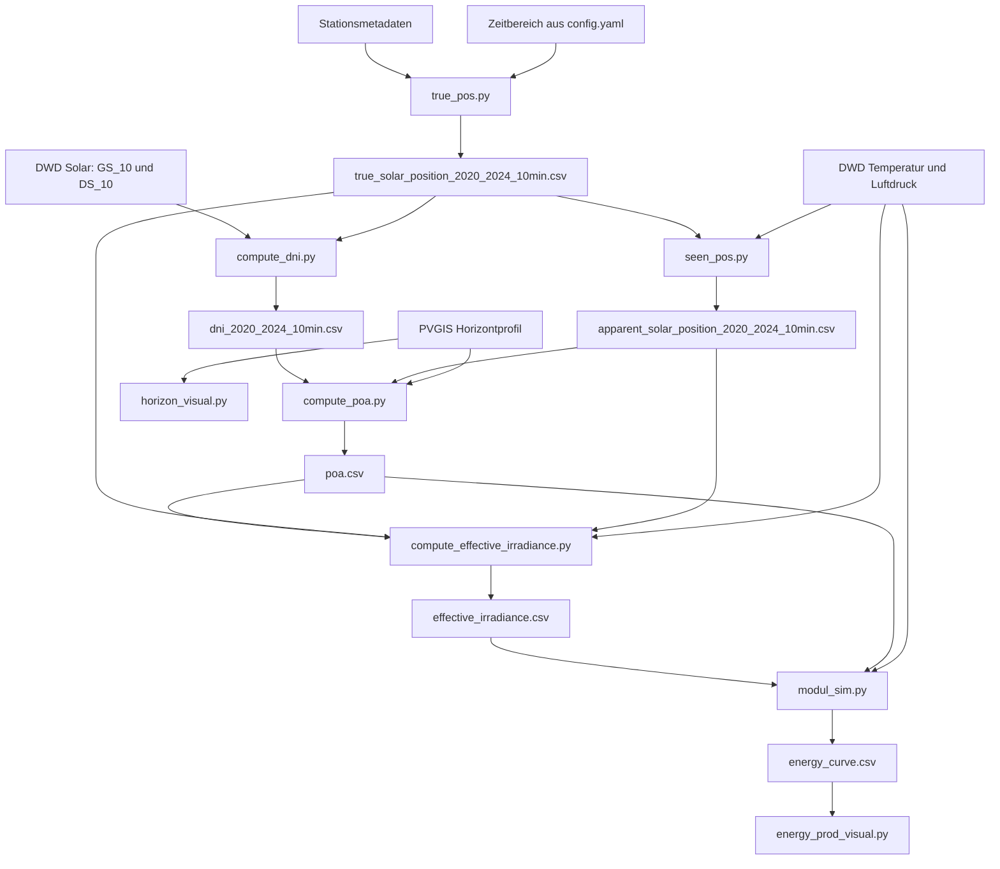
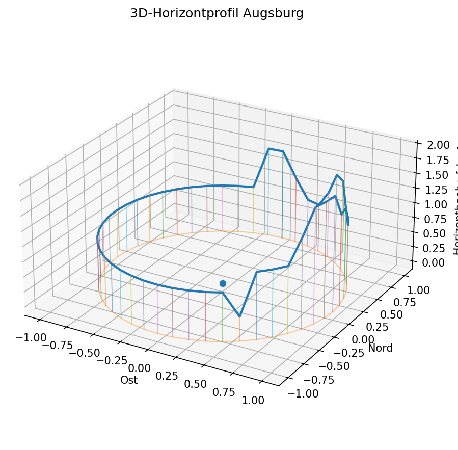
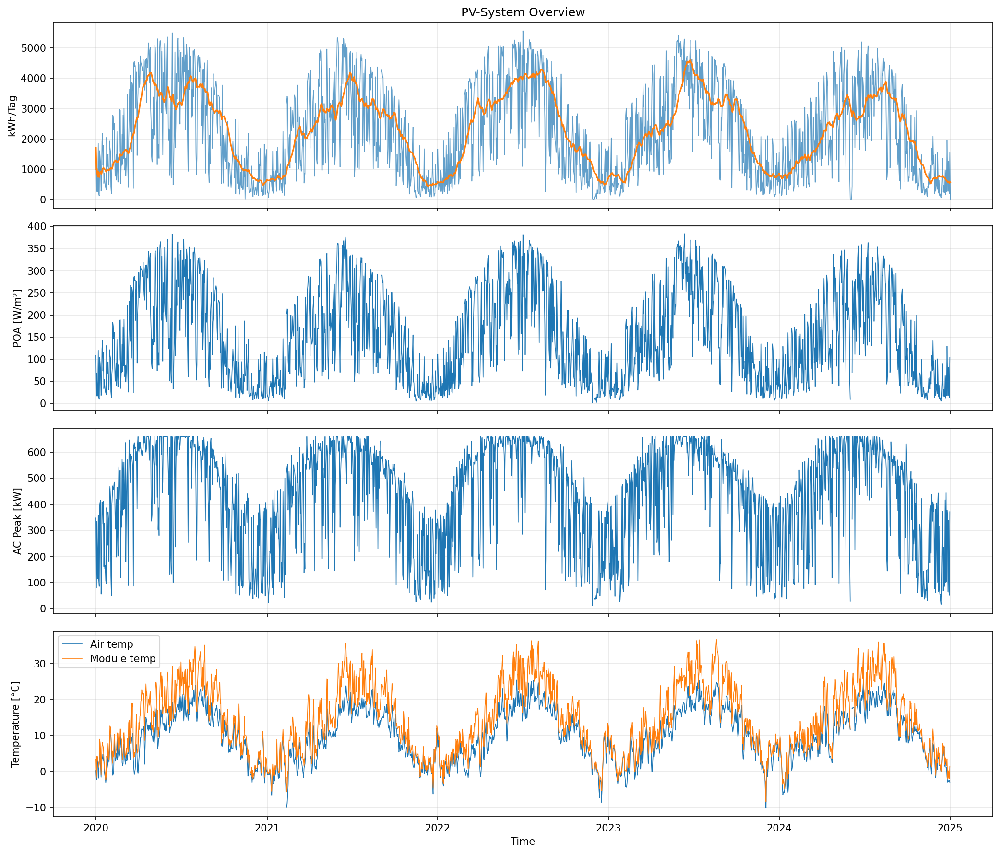

# PV-Simulation

Dieser Ordner enthält die PV-Erzeugungssimulation des Projekts. Aus DWD-Wetterdaten,
DWD-Strahlungsdaten, Stationsmetadaten und einem PVGIS-Horizontprofil wird eine
zeitaufgelöste AC-Energiezeitreihe für die konfigurierte PV-Anlage berechnet.

## Kurzüberblick

- Standort: Augsburg
- Simulationszeitraum: 2020-01-01 00:00 UTC bis 2025-01-01 00:00 UTC
- Zeitauflösung: 10 Minuten
- Modulausrichtung: 180 deg, also Süd
- Modulneigung: 20 deg
- Eingangsquellen: DWD, PVGIS, lokale Konfiguration
- Hauptausgabe: `results/energy_curve.csv`

Die zentralen Parameter stehen in:

```text
configs/config.yaml
```

## Ausführen

Vom Repository-Root:

```bash
python run_pv_sim.py
```

Der Runner führt die Schritte in dieser Reihenfolge aus:

1. `true_pos.py`
2. `seen_pos.py`
3. `compute_dni.py`
4. `compute_poa.py`
5. `compute_effective_irradiance.py`
6. `modul_sim.py`
7. `visualization/horizon_visual.py`
8. `visualization/energy_prod_visual.py`

Wenn einzelne Schritte separat ausgeführt werden, muss beachtet werden, dass viele
Skripte die CSV-Ausgaben der vorherigen Schritte erwarten.

## Abhängigkeiten

Die Skripte verwenden diese Python-Pakete:

```bash
pip install pandas numpy pvlib pyyaml matplotlib
```

`pvlib` übernimmt dabei die physikalischen Standardmodelle für Sonnenposition,
Einstrahlungszerlegung, POA-Berechnung, Modultemperatur, DC-Leistung und
Wechselrichtermodell.

## Datenfluss



## Ordnerstruktur

```text
pv_sim/
  true_pos.py
  seen_pos.py
  compute_dni.py
  compute_poa.py
  compute_effective_irradiance.py
  modul_sim.py
  visualization/
    horizon_visual.py
    energy_prod_visual.py
```

## Skripte

| Datei | Aufgabe | Wichtigste Inputs | Output |
|---|---|---|---|
| `true_pos.py` | Berechnet die geometrische Sonnenposition für den Standort. | `metadata_stations.csv`, Zeitbereich aus `config.yaml` | `data/true_solar_position_2020_2024_10min.csv` |
| `seen_pos.py` | Berechnet die scheinbare Sonnenposition unter Berücksichtigung von Temperatur und Luftdruck. | wahre Sonnenposition, DWD-Meteodaten | `data/apparent_solar_position_2020_2024_10min.csv` |
| `compute_dni.py` | Berechnet Direktnormalstrahlung aus globaler und diffuser horizontaler Strahlung. | DWD-Solardaten, Sonnenzenit | `data/dni_2020_2024_10min.csv` |
| `compute_poa.py` | Berechnet die Einstrahlung in Modulebene inklusive Horizontverschattung. | DNI/GHI/DHI, scheinbare Sonnenposition, PVGIS-Horizont | `data/poa.csv` |
| `compute_effective_irradiance.py` | Berechnet Einfallswinkel und effektive Einstrahlung nach IAM-Korrektur. | POA, Sonnenposition, Meteodaten | `data/effective_irradiance.csv` |
| `modul_sim.py` | Berechnet Modultemperatur, DC-Leistung, Verluste, AC-Leistung und Energie. | POA, effektive Einstrahlung, Meteodaten, PV- und Inverterparameter | `results/energy_curve.csv` |
| `visualization/horizon_visual.py` | Erstellt eine 3D-Visualisierung des Horizontprofils. | PVGIS-Horizontprofil | `results/horizon_profile.png` |
| `visualization/energy_prod_visual.py` | Erstellt eine Tagesübersicht der simulierten Energie. | `energy_curve.csv` | `results/energy_overview.png` |

## Eingangsdaten

Die Pfade werden in `configs/config.yaml` verwaltet.

| Config-Key | Datei | Bedeutung |
|---|---|---|
| `paths.metadata` | `data/metadata_stations.csv` | Stations-ID, Stationsname, Breiten- und Längengrad, Höhe über NN |
| `paths.meteo` | `data/dwd_temp_pressure_wind_10min_2020_2024.csv` | Temperatur, Luftdruck und Wind im 10-Minuten-Raster |
| `paths.solar` | `data/dwd_solar_data_10min_2020_2024.csv` | DWD-Strahlungsdaten |
| `paths.pvgis` | `data/pvgis_horizon_augsburg.csv` | Horizonthöhe pro Azimutrichtung |
| `paths.true_sun_position` | `data/true_solar_position_2020_2024_10min.csv` | geometrische Sonnenposition |
| `paths.apparent` | `data/apparent_solar_position_2020_2024_10min.csv` | scheinbare Sonnenposition |
| `paths.dni` | `data/dni_2020_2024_10min.csv` | berechnete Direktnormalstrahlung |
| `paths.poa` | `data/poa.csv` | Einstrahlung auf Modulebene |
| `paths.effective_irradiance` | `data/effective_irradiance.csv` | effektive Einstrahlung nach IAM |
| `paths.energy` | `results/energy_curve.csv` | finale PV-Erzeugungszeitreihe |

## Zeitmodell

Die Simulation verwendet 10-Minuten-Intervalle. In `true_pos.py` wird für jedes
Intervall nicht der Startzeitpunkt, sondern die Intervallmitte als Referenzzeitpunkt
für die Sonnenposition verwendet:

```text
times_ref = times_start + freq / 2
timestamp_utc = times_start + freq
```

Damit beschreibt `timestamp_utc` das Ende des 10-Minuten-Intervalls, während
`solar_position_reference_utc` die physikalische Referenzzeit in der Intervallmitte
ist. Das ist sinnvoll, weil DWD-Strahlungswerte die Energiemenge über ein Intervall
beschreiben und nicht nur einen instantanen Punktwert am Intervallstart.

## Mathematisches Modell

### 1. Geometrische Sonnenposition

`true_pos.py` berechnet die wahre Sonnenposition mit:

```python
pvlib.solarposition.get_solarposition(...)
```

Verwendete Standortgrößen:

- geographische Breite `latitude`
- geographische Länge `longitude`
- Stationshöhe `height_m_amsl`
- Referenzzeit `solar_position_reference_utc`

Erzeugte Größen:

- Sonnenzenit `solar_zenith_deg`
- Sonnenhöhe `solar_elevation_deg`
- Sonnenazimut `solar_azimuth_deg`

Zwischen Zenit und Höhe gilt:

$$
\alpha = 90^\circ - \theta_z
$$

mit:

- $\alpha$: Sonnenhöhe
- $\theta_z$: Sonnenzenitwinkel

### 2. Scheinbare Sonnenposition

`seen_pos.py` berechnet die scheinbare Sonnenposition mit der SPA-Implementierung
von `pvlib`:

```python
pvlib.solarposition.spa_python(...)
```

Im Gegensatz zur geometrischen Position wird hier die atmosphärische Refraktion
berücksichtigt. Dafür werden Temperatur und Luftdruck verwendet.

Die Korrektur wird als Differenz gespeichert:

$$
\Delta \alpha_{ref} = \alpha_{app} - \alpha_{true}
$$

mit:

- $\alpha_{app}$: scheinbare Sonnenhöhe
- $\alpha_{true}$: geometrische Sonnenhöhe
- $\Delta \alpha_{ref}$: Refraktionskorrektur

Falls für einen Zeitschritt keine gültigen Meteodaten vorhanden sind, wird die
wahre Sonnenposition als Fallback verwendet. Diese Zeilen werden über
`met_data_complete` markiert.

### 3. Umrechnung der DWD-Strahlungswerte

DWD liefert `GS_10` und `DS_10` als Energie pro Fläche für ein 10-Minuten-Intervall.
Die Einheit ist `J/cm^2`. Für die weitere PV-Rechnung wird daraus eine mittlere
Leistung pro Fläche in `W/m^2` berechnet.

Die Umrechnung ist:

$$
G_{W/m^2} = E_{J/cm^2} \cdot \frac{10000}{600}
$$

Begründung:

- $1 m^2 = 10000 cm^2$
- $10 min = 600 s$
- $1 W = 1 J/s$

Im Code:

```python
JCM2_10MIN_TO_WM2 = 10000.0 / 600.0
```

### 4. Direktnormalstrahlung

`compute_dni.py` berechnet aus Globalstrahlung, Diffusstrahlung und Sonnenzenit die
Direktnormalstrahlung:

$$
DNI = \frac{GHI - DHI}{\cos(\theta_z)}
$$

mit:

- $DNI$: Direct Normal Irradiance
- $GHI$: Global Horizontal Irradiance
- $DHI$: Diffuse Horizontal Irradiance
- $\theta_z$: Sonnenzenitwinkel

Im Code wird dafür verwendet:

```python
pvlib.irradiance.dni(...)
```

Fehlwerte aus DWD werden über den konfigurierten Wert `-999.0` erkannt und als
`NaN` behandelt.

### 5. Horizontverschattung

`compute_poa.py` verwendet das PVGIS-Horizontprofil. Dieses enthält zu diskreten
Azimutrichtungen jeweils die Horizonthöhe:

```text
azimuth_deg, horizon_height_deg
```

Da die Sonne beliebige Azimutwinkel annehmen kann, wird das Horizontprofil zyklisch
interpoliert:

$$
h_{hor}(\varphi_{sun}) =
interp(\varphi_{sun}; \varphi_i, h_i)
$$

mit:

- $\varphi_{sun}$: Sonnenazimut
- $h_{hor}$: interpolierte Horizonthöhe
- $\varphi_i, h_i$: Stützpunkte aus dem PVGIS-Horizontprofil

Eine direkte Verschattung liegt vor, wenn:

$$
\alpha_{app} \leq h_{hor}(\varphi_{sun})
$$

Dann wird die direkte Strahlung für diesen Zeitschritt auf null gesetzt:

$$
DNI_{shaded} =
\begin{cases}
0, & \alpha_{app} \leq h_{hor}(\varphi_{sun}) \\
DNI, & \alpha_{app} > h_{hor}(\varphi_{sun})
\end{cases}
$$

Diffuse Strahlung wird dadurch nicht auf null gesetzt. Das Modell bildet also nur
die Blockierung der direkten Sonnenscheibe durch den Horizont ab.

### 6. Einstrahlung auf die Modulebene

Die Plane-of-Array-Einstrahlung beschreibt, wie viel Strahlung auf der geneigten
Modulebene ankommt.

Die Gesamt-POA setzt sich aus mehreren Anteilen zusammen:

$$
G_{POA} = G_{POA,direct} + G_{POA,sky-diffuse} + G_{POA,ground-diffuse}
$$

Der direkte Anteil hängt vom Einfallswinkel ab:

$$
G_{POA,direct} = DNI_{shaded} \cdot \max(\cos(\theta_i), 0)
$$

Der Einfallswinkel $\theta_i$ ergibt sich aus Sonnenstand und Modulorientierung:

$$
\begin{aligned}
\cos(\theta_i) &=
\cos(\theta_z)\cos(\beta) \\
&\quad + \sin(\theta_z)\sin(\beta)\cos(\gamma_s - \gamma_p)
\end{aligned}
$$

mit:

- $\theta_i$: Angle of Incidence, Einfallswinkel auf das Modul
- $\theta_z$: Sonnenzenit
- $\beta$: Modulneigung
- $\gamma_s$: Sonnenazimut
- $\gamma_p$: Modulazimut

Im Code wird die gesamte POA-Berechnung über `pvlib` ausgeführt:

```python
pvlib.irradiance.get_total_irradiance(
    model="perez-driesse",
)
```

Das Perez-Driesse-Modell wird für die Himmelsdiffusstrahlung verwendet. Zusätzlich
gehen ein:

- `dni_extra`: extraterrestrische Direktstrahlung
- `relative_airmass`: relative Air Mass
- `albedo`: Bodenreflexion

### 7. Relative Air Mass

Die relative Air Mass beschreibt die effektive Weglänge der Sonnenstrahlung durch
die Atmosphäre relativ zum senkrechten Durchgang.

Vereinfacht gilt:

$$
AM \approx \frac{1}{\cos(\theta_z)}
$$

In der Simulation wird jedoch die robustere `pvlib`-Berechnung genutzt:

```python
pvlib.atmosphere.get_relative_airmass(...)
```

Diese Größe wird für das Perez-Driesse-Modell und für die weitere
Einstrahlungsmodellierung verwendet.

### 8. Einfallswinkelverlust und effektive Einstrahlung

`compute_effective_irradiance.py` berechnet zuerst den Einfallswinkel:

```python
pvlib.irradiance.aoi(...)
```

Danach wird ein IAM-Faktor bestimmt:

```python
pvlib.iam.physical(...)
```

IAM steht für `Incidence Angle Modifier`. Der Faktor beschreibt, dass ein Modul bei
flachem Lichteinfall weniger direkt nutzbare Strahlung absorbiert als bei senkrechtem
Einfall.

Die effektive Einstrahlung wird berechnet als:

$$
G_{eff} = G_{POA,direct} \cdot IAM(\theta_i) + G_{POA,diffuse}
$$

Im Code:

```python
effective_irradiance = poa_direct * iam + poa_diffuse
```

### 9. Modultemperatur

`modul_sim.py` berechnet die Modultemperatur mit dem Faiman-Modell:

$$
T_{module} = T_{air} + \frac{G_{POA}}{u_0 + u_1 \cdot v_{wind}}
$$

mit:

- $T_{module}$: Modultemperatur in `deg C`
- $T_{air}$: Lufttemperatur in `deg C`
- $G_{POA}$: globale POA-Einstrahlung in `W/m^2`
- $v_{wind}$: Windgeschwindigkeit
- $u_0 = 20.0$
- $u_1 = 5.0$

Im Code:

```python
pvlib.temperature.faiman(
    u0=20.0,
    u1=5,
)
```

Die Koeffizienten sind aktuell Annahmen aus der `pvlib`-Dokumentation und nicht
anlagenspezifisch kalibriert.

### 10. DC-Leistung

Die Brutto-DC-Leistung wird mit PVWatts berechnet:

$$
P_{DC,gross} =
P_{DC,0}
\cdot \frac{G_{eff}}{1000}
\cdot \left(1 + \gamma_{PDC}(T_{module} - 25)\right)
$$

mit:

- $P_{DC,0}$: installierte DC-Nennleistung bei STC
- $G_{eff}$: effektive Einstrahlung
- $\gamma_{PDC}$: Temperaturkoeffizient der DC-Leistung
- $T_{module}$: Modultemperatur

Die installierte DC-Leistung ergibt sich aus:

$$
P_{DC,0,total} = P_{module} \cdot N_{module}
$$

Mit den aktuellen Konfigurationswerten:

$$
P_{DC,0,total} = 495 W \cdot 1584 = 784080 W
$$

also:

$$
P_{DC,0,total} = 784.08 kW
$$

### 11. Verluste

Die Simulation verwendet `pvlib.pvsystem.pvwatts_losses(...)`. Berücksichtigt werden:

| Verlustart | Wert |
|---|---:|
| Soiling | 2.0 % |
| Shading | 3.0 % |
| Snow | 0.0 % |
| Mismatch | 2.0 % |
| Wiring | 2.0 % |
| Connections | 0.5 % |
| LID | 1.5 % |
| Nameplate rating | 1.0 % |
| Availability | 3.0 % |
| Age | zeitabhängig |

Die Alterung wird linear über die Zeit modelliert:

$$
L_{age}(t) = r_{age} \cdot t_{years}
$$

mit:

- $r_{age} = 0.5$ Prozentpunkte pro Jahr
- $t_{years}$: Jahre seit Simulationsbeginn

Aus dem Gesamtverlust $L$ entsteht der Netto-DC-Faktor:

$$
f_{loss} = 1 - \frac{L}{100}
$$

Damit:

$$
P_{DC,net} = P_{DC,gross} \cdot f_{loss}
$$

### 12. Wechselrichtermodell

Die AC-Leistung wird mit dem PVWatts-Wechselrichtermodell berechnet:

```python
pvlib.inverter.pvwatts(...)
```

Die AC-Nennleistung der Gesamtanlage ist:

$$
P_{AC,0,total} = P_{AC,0,each} \cdot N_{inverter}
$$

Mit den aktuellen Konfigurationswerten:

$$
P_{AC,0,total} = 110000 W \cdot 6 = 660000 W
$$

also:

$$
P_{AC,0,total} = 660 kW
$$

Die für PVWatts verwendete DC-Eingangsreferenz des Wechselrichters wird aus der
nominalen Effizienz bestimmt:

$$
P_{DC,0,inverter} = \frac{P_{AC,0,total}}{\eta_{inv,nom}}
$$

Mit $\eta_{inv,nom} = 0.982$:

$$
P_{DC,0,inverter} \approx 672097.76 W
$$

Das DC/AC-Verhältnis der aktuellen Konfiguration ist:

$$
\frac{P_{DC,0,total}}{P_{AC,0,total}}
= \frac{784.08}{660}
\approx 1.19
$$

### 13. Energie pro Zeitschritt

Die Energie wird aus der AC-Leistung und der Zeitschrittlänge berechnet:

$$
E_{AC,kWh} = \frac{P_{AC,W}}{1000} \cdot \Delta t_h
$$

Bei 10 Minuten:

$$
\Delta t_h = \frac{10}{60} = \frac{1}{6} h
$$

Damit:

$$
E_{AC,kWh} = \frac{P_{AC,W}}{6000}
$$

## Wichtige Konfigurationswerte

| Bereich | Key | Wert | Bedeutung |
|---|---|---:|---|
| `time` | `freq` | `10min` | Simulationsauflosung |
| `pv` | `surface_tilt` | 20 | Modulneigung in deg |
| `pv` | `surface_azimuth` | 180 | Modulazimut in deg |
| `pv` | `albedo` | 0.20 | Bodenreflexion |
| `pv` | `module_pdc0` | 495.0 | DC-Nennleistung eines Moduls in W |
| `pv` | `module_count` | 1584 | Anzahl Module |
| `pv` | `gamma_pdc` | -0.0029 | relativer Temperaturkoeffizient pro deg C |
| `inverter` | `pac0_each` | 110000.0 | AC-Nennleistung eines Wechselrichters in W |
| `inverter` | `inverter_count` | 6 | Anzahl Wechselrichter |
| `inverter` | `eta_inv_nom` | 0.982 | nominaler Wechselrichterwirkungsgrad |
| `losses` | `annual_age_loss_pct` | 0.5 | Alterungsverlust in Prozentpunkten pro Jahr |

## Ergebnisdateien

### `data/true_solar_position_2020_2024_10min.csv`

Enthält die geometrische Sonnenposition:

| Spalte | Bedeutung |
|---|---|
| `solar_position_reference_utc` | Referenzzeitpunkt in der Intervallmitte |
| `timestamp_utc` | Ende des 10-Minuten-Intervalls |
| `station_id` | DWD-Stations-ID |
| `latitude` | Breite |
| `longitude` | Länge |
| `height_m_amsl` | Höhe über NN |
| `solar_zenith_deg` | geometrischer Sonnenzenit |
| `solar_elevation_deg` | geometrische Sonnenhöhe |
| `solar_azimuth_deg` | Sonnenazimut |

### `data/apparent_solar_position_2020_2024_10min.csv`

Enthält die scheinbare Sonnenposition:

| Spalte | Bedeutung |
|---|---|
| `apparent_zenith_deg` | scheinbarer Sonnenzenit |
| `apparent_elevation_deg` | scheinbare Sonnenhöhe |
| `apparent_azimuth_deg` | scheinbarer Sonnenazimut |
| `refraction_correction_deg` | atmosphärische Refraktionskorrektur |
| `met_data_complete` | gibt an, ob Temperatur und Luftdruck vorhanden waren |

### `data/dni_2020_2024_10min.csv`

Enthält die Strahlungskomponenten:

| Spalte | Bedeutung |
|---|---|
| `ghi_wm2` | Global Horizontal Irradiance |
| `dhi_wm2` | Diffuse Horizontal Irradiance |
| `dni_wm2` | Direct Normal Irradiance |

### `data/poa.csv`

Enthält die Einstrahlung auf Modulebene. Die wichtigsten Spalten aus `pvlib` sind:

| Spalte | Bedeutung |
|---|---|
| `poa_global` | gesamte Einstrahlung auf Modulebene |
| `poa_direct` | direkter Anteil auf Modulebene |
| `poa_diffuse` | diffuser Anteil auf Modulebene |
| `poa_sky_diffuse` | diffuser Himmelsanteil |
| `poa_ground_diffuse` | Bodenreflexionsanteil |

### `data/effective_irradiance.csv`

Enthält die IAM-korrigierte Einstrahlung:

| Spalte | Bedeutung |
|---|---|
| `aoi_deg` | Einfallswinkel auf das Modul |
| `airmass_relative` | relative Air Mass |
| `airmass_absolute` | druckkorrigierte absolute Air Mass |
| `iam` | Incidence Angle Modifier |
| `effective_irradiance` | effektiv nutzbare Einstrahlung |

### `results/energy_curve.csv`

Finale Zeitreihe der PV-Simulation:

| Spalte | Bedeutung |
|---|---|
| `poa_global` | globale POA-Einstrahlung |
| `TT_10` | Lufttemperatur |
| `FF_10` | Windgeschwindigkeit |
| `effective_irradiance` | effektive Einstrahlung |
| `t_module_faiman_c` | Modultemperatur nach Faiman |
| `p_dc_gross_w` | DC-Bruttoleistung |
| `age_loss_pct` | zeitabhängiger Alterungsverlust |
| `p_dc_net_w` | DC-Nettoleistung nach Verlusten |
| `p_ac_w` | AC-Leistung nach Wechselrichter |
| `e_net_ac_kwh` | AC-Energie im Zeitschritt |

## Visualisierungen

Die Visualisierungen liegen im Ordner `results/`.

### Horizontprofil

Das Horizontprofil zeigt die Umgebungshöhe abhängig vom Azimut. Es wird zur
direkten Horizontverschattung genutzt.



### Energieübersicht

Die Energieübersicht aggregiert die 10-Minuten-Ergebnisse auf Tageswerte und zeigt:

- tägliche AC-Energie
- gleitenden 30-Tage-Mittelwert
- mittlere POA-Einstrahlung
- tägliche AC-Spitzenleistung
- Luft- und Modultemperatur



## Qualitätssicherung im Code

Mehrere Skripte prüfen oder stabilisieren die Daten:

- Pflichtspalten werden validiert, bevor gerechnet wird.
- DWD-Fehlwerte `-999` werden in `NaN` umgewandelt.
- Zeitreihen werden nach `timestamp_utc` sortiert.
- Merges verwenden teilweise `validate="one_to_one"`, damit doppelte Zeitstempel auffallen.
- Negative Einstrahlungswerte werden vor der POA-Berechnung auf null begrenzt.
- Fehlende Meteodaten in `seen_pos.py` führen zu einem expliziten Fallback auf die wahre Sonnenposition.
- Horizontazimut wird zyklisch interpoliert, damit der Übergang von 359 deg auf 0 deg korrekt behandelt wird.

## Modellgrenzen

Diese Simulation ist eine technische Näherung und kein vollständiges
Anlagen- oder Ertragsgutachten.

Wichtige Grenzen:

- Horizontverschattung ist binär: Die direkte Strahlung wird entweder durchgelassen oder auf null gesetzt.
- Nahe Verschattung durch Gebäude, Bäume, Reihenabstände oder Modulverkabelung wird nicht geometrisch modelliert.
- Diffuse Verschattung durch den Horizont wird nicht detailliert reduziert.
- IAM wird vereinfacht über `pvlib.iam.physical` berechnet und nicht modulspezifisch kalibriert.
- Das Faiman-Temperaturmodell nutzt angenommene Koeffizienten.
- PVWatts ist ein vereinfachtes Leistungsmodell und ersetzt kein detailliertes Ein-Dioden-Modell.
- Verlustannahmen sind pauschal und nicht aus Messdaten validiert.
- Schnee, Verschmutzung und Verfügbarkeit werden nur als pauschale Verlustprozente modelliert.

## Typische Anpassungen

### Anderen Standort simulieren

In `configs/config.yaml`:

```yaml
station:
  id: "..."
  name: "..."
```

Zusätzlich müssen passende DWD-Daten, Stationsmetadaten und ein passendes
PVGIS-Horizontprofil vorhanden sein.

### Andere PV-Anlage simulieren

In `configs/config.yaml`:

```yaml
pv:
  surface_tilt: 20
  surface_azimuth: 180
  module_pdc0: 495.0
  module_count: 1584

inverter:
  pac0_each: 110000.0
  inverter_count: 6
  eta_inv_nom: 0.982
```

Nach einer Änderung sollten alle Schritte neu ausgeführt werden:

```bash
python run_pv_sim.py
```

### Andere Verlustannahmen verwenden

Die festen Verlustwerte stehen aktuell direkt in `modul_sim.py`:

```python
pvlib.pvsystem.pvwatts_losses(
    soiling=2,
    shading=3,
    snow=0,
    mismatch=2,
    wiring=2,
    connections=0.5,
    lid=1.5,
    nameplate_rating=1,
    age=df["age_loss_pct"],
    availability=3,
)
```

Wenn diese Werte häufig angepasst werden sollen, sollten sie in `configs/config.yaml`
verschoben werden.

## Ergebnisinterpretation

Die wichtigste Spalte für weitere Analysen ist:

```text
results/energy_curve.csv -> e_net_ac_kwh
```

Die Jahresenergie kann beispielsweise aus der Summe berechnet werden:

$$
E_{year} = \sum_t E_{AC,kWh,t}
$$

Die Leistungsspitzen können über `p_ac_w` analysiert werden:

$$
P_{AC,max} = \max_t(P_{AC,W,t})
$$

Für Batterie- oder Wirtschaftlichkeitsmodelle sollte in der Regel
`e_net_ac_kwh` verwendet werden, weil diese Größe bereits Verluste und
Wechselrichtermodell enthält.
